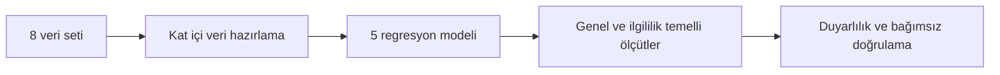

# Dengesiz Regresyon Öğreniminde SMOTE Tabanlı Yaklaşımların Karşılaştırılması

Bu depo, dengesiz regresyon problemlerinde SMOTE tabanlı yeniden örnekleme yaklaşımlarını, ilgililik ağırlıklı öğrenmeyi ve standart regresyon modellerini ortak bir deneysel düzende karşılaştıran yüksek lisans tezinin kodlarını, sonuçlarını ve yeniden üretilebilirlik kayıtlarını içerir.

## Tez bilgileri

| Alan | Bilgi |
|---|---|
| Yazar | Erkan Tuzcu |
| Üniversite | Ondokuz Mayıs Üniversitesi |
| Enstitü | Lisansüstü Eğitim Enstitüsü |
| Ana Bilim Dalı | İstatistik |
| Program | Veri Bilimi Tezli Yüksek Lisans Programı |
| Danışman | Doç. Dr. Hasan Bulut |
| Tarih | Temmuz 2026 |
| ORCID | [0009-0000-6595-1171](https://orcid.org/0009-0000-6595-1171) |

## Araştırmanın amacı

Hedef değişkenin bazı bölgelerinin az sayıda gözlemle temsil edildiği regresyon problemlerinde genel tahmin başarısı ile seyrek ve yüksek ilgililik taşıyan hedef bölgelerindeki başarı farklılaşabilir. Bu çalışma, SMOTE tabanlı yöntemlerin hangi veri yapılarında ve hangi performans ölçütlerinde avantaj sağladığını ortak, grup kontrollü ve veri sızıntısını önleyen bir deney tasarımı altında incelemektedir.

## Deneysel kapsam

| Bileşen | Kapsam |
|---|---|
| Veri setleri | 6 karşılaştırma veri seti ve 2 TGSS 2024 uygulaması |
| Modeller | EKK, RF, SMOTE-R + RF, SMOGN + RF, İlgililik Ağırlıklı RF |
| Ana protokol | Grup kontrollü, iki tekrarlı 5 katlı çapraz doğrulama |
| Duyarlılık analizleri | Veri hazırlama kararları ve grup kontrollü tek 10 katlı çapraz doğrulama |
| Performans ölçütleri | RMSE, MAE, R², WMSE, SERA, OİHA, nadir ve normal bölge RMSE |
| Toplam değerlendirme | 1.450 kat-model değerlendirmesi |
| Bağımsız doğrulama | 88/88 model birinciliği ve 88/88 tam sıralama uyumu |

## Araştırma iş akışı



Kodlama, eksik değer tamamlama, standartlaştırma, ilgililik fonksiyonu ve yeniden örnekleme işlemleri yalnız eğitim katlarında yürütülür. Özdeş açıklayıcı değişken vektörleri aynı grup içinde tutularak eğitim ve test kümeleri arasında kayıt örtüşmesi önlenir.

## Temel bulgu

Hiçbir yöntem bütün veri setleri ve performans ölçütlerinde evrensel üstünlük göstermemiştir. Standart Rastgele Orman birçok veri setinde genel hata ölçütlerinde güçlü sonuçlar üretirken, SMOTE-R ve SMOGN tabanlı modeller ilgililik duyarlı ölçütlerde daha sık en düşük ortalama değerlere ulaşmıştır. Bu bulgu, model seçiminin hedef dağılımı ve uygulama amacı dikkate alınarak genel ve ilgililik temelli ölçütlerle birlikte yapılması gerektiğini göstermektedir.

## Depo içeriği

| Dizin veya dosya | İçerik |
|---|---|
| `src/` | Veri hazırlama, kat içi modelleme, yeniden örnekleme ve ölçüt hesaplama kodları |
| `scripts/` | Ana deney, duyarlılık analizi ve bağımsız yeniden üretim çalıştırıcıları |
| `data/metadata/` | Veri sözlüğü, şema ve deney bölme kayıtları |
| `data/aggregates/` | Kamuya açık paylaşım için uygun TGSS özetleri |
| `outputs/results/` | Tam hassasiyetli kat-model sonuçları |
| `outputs/tables/` | Tez tablolarının kaynak dosyaları |
| `outputs/figures/` | Tezde kullanılan şekiller |
| `validation/` | Bütünlük ve bağımsız yeniden üretim doğrulamaları |
| `docs/` | Deney protokolü, veri erişimi ve yeniden üretim belgeleri |
| `CITATION.cff` | Akademik atıf bilgisi |

## Ortam kurulumu

Çalışma Python 3.13.5 ortamında yürütülmüştür.

```bash
python -m venv .venv
```

Linux ve macOS:

```bash
source .venv/bin/activate
python -m pip install --upgrade pip
pip install -r requirements.txt
```

Windows PowerShell:

```powershell
.venv\Scripts\Activate.ps1
python -m pip install --upgrade pip
pip install -r requirements.txt
```

## Verilerin hazırlanması

Ham veri dosyaları bu depoda paylaşılmaz. Karşılaştırma veri setleri özgün sağlayıcılarından edinilerek `data/raw/README.md` içinde belirtilen yerel dizin yapısına yerleştirilir.

Alternatif bir veri dizini kullanılacaksa:

```bash
export THESIS_RAW_DATA_DIR=/yerel/veri/dizini
```

Windows PowerShell:

```powershell
$env:THESIS_RAW_DATA_DIR = "C:\yerel\veri\dizini"
```

## Deneylerin çalıştırılması

Ana deney ve veri hazırlama duyarlılıkları:

```bash
python scripts/run_main_and_data_sensitivity.py
```

Grup kontrollü tek 10 kat duyarlılığı:

```bash
python scripts/run_protocol_sensitivity_10fold.py
```

Bağımsız yeniden üretim:

```bash
python scripts/run_independent_reproduction.py
```

Komutların ürettiği çalışma dosyaları `.runs/` altında tutulur ve Git tarafından izlenmez. Beklenen değerlendirme sayıları, doğrulama toleransları ve çıktı kontrolleri `docs/reproducibility.md` içinde açıklanır.

## TGSS veri erişimi ve gizlilik

TGSS 2024 mikro verisi erişim ve kullanım koşullarına tabidir. Bu depoda:

- ham veya hazırlanmış satır düzeyi TGSS verisi,
- satır düzeyi tahmin veya artıklar,
- katılımcı anahtarı veya özgün kayıt numarası,
- küçük hücre sıklıkları

bulunmaz.

Yalnız veri hazırlama kuralları, değişkenlerin analitik rolleri, gelir kategorilerinin temsilî değerlere dönüştürülmesi, yeterli yuvarlama uygulanmış özetler ve kat-model düzeyindeki sonuçlar paylaşılır. Ayrıntılar `docs/data_access_and_privacy.md` içindedir.

## Sonuçların doğrulanması

Depo doğrulama aracı:

```bash
python tests/validate_repository.py
```

Doğrulama işlemi dosya bütünlüğünü, beklenen sonuç sayılarını, yeniden üretim kayıtlarını ve kısıtlı veri bulunmadığını denetler.

## Atıf ve lisans

Bu çalışmayı akademik bir yayında, yazılımda veya veri bilimi araştırmasında kullanırken `CITATION.cff` dosyasında verilen tez künyesiyle atıf yapılmalıdır.

Kaynak kod, çalıştırma betikleri, testler ve otomasyon dosyaları MIT Lisansı
kapsamındadır. Belgeler ve araştırma çıktıları CC BY 4.0 kapsamında
yayımlanmaktadır. Ham TGSS mikro verisi ile üçüncü taraf veri setleri bu
lisansların kapsamında değildir. Ayrıntılı kapsam `LICENSE`, `LICENSE-CODE` ve
`LICENSE-CONTENT.md` dosyalarında açıklanır.
